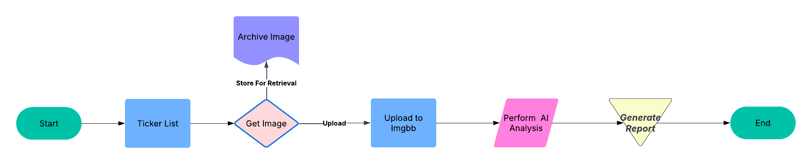

# Stock Candle Wick Analyzers

# Update 2.20.25 - Imagekit Vision Report Generator Ready 👓💹🎊

The [Imagekit Vision Analysis](scripts/imagekit-vision-analysis-hourglass-version.ipynb) script is now available.

# Wick Machine Vision Analysis 🚧 - Check back for new scripts!

This Repository is a collection of minimal scripts that perform the following intended steps:

1)Create a stock candle chart of a defined stock.  
2)Upload this chart to imagekit.io.  
3)Using LLM vision models, analyze the uploaded images-- this repository uses OpenAI's GPT-4o.  

The fatman script uses LLM chat completion, while the imagekit test is running into write permission issues that will be updated as time permits.  

Check back later for optimized scripts, since this project is still in the debugging phase :construction: :building_construction: :construction_worker:   

Currently in the task pipeline:  

- Successfully upload image to imagekit.io and analyze with LLM. ✔️
- Generate sample output text files. ✔️

